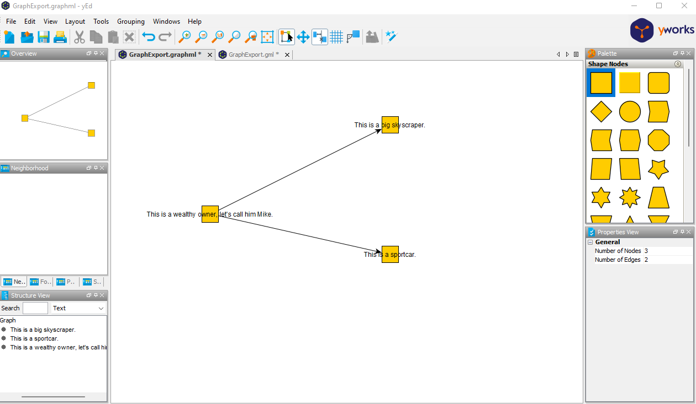

## Repo for sample code and hints to visualize jgraphT Graphs by exporting them to Gml or GraphML 

This repo should provide a rough sketch on how to export jgraphT Graphs to GML and GraphML to visualize them.
It was born out of the motivation that I found no good tutorial on how to visualize java in-memory graphs.

In combination with [yED](https://www.yworks.com/products/yed) this can be achieved by the code and examples that can be found on the nice-looking github pages site:
https://daniel-ebert.github.io/jgrapht-graph-exporting-examples/

Hopefully it also can help you to visualize a java jgraphT graph besides the existing ways such as JGraphX.
The JgraphX Adapter with this
[sample code](https://github.com/jgrapht/jgrapht/blob/master/jgrapht-demo/src/main/java/org/jgrapht/demo/JGraphXAdapterDemo.java)
worked mostly fine for me, but for more complex graphs it required for me too much investigation on how to optimize the visualization.

Another repo worth looking at might be [GML-Writer-for-yED](https://github.com/Systemdir/GML-Writer-for-yED)

The results based on the sample code of this repo could look like this:

