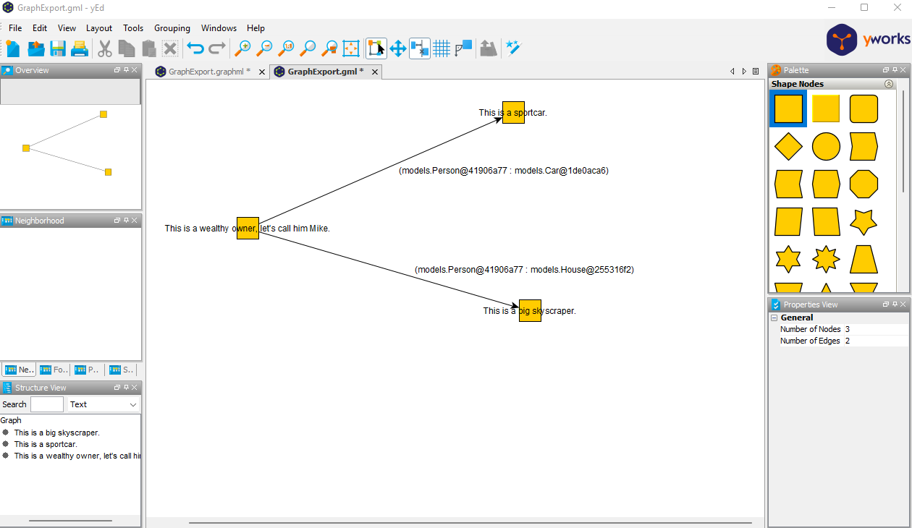

## Tutorial for Exporting jgraphT Graphs to Gml and GraphML
This page should provide a rough sketch on how to export jgraphT Graphs to GML and GraphML to visualize them.
It was born out of the motivation that I found no good tutorial on how to visualize java in-memory graphs.

In combination with yED this can be achieved by the code and examples explained below.
Hopefully it also can help you to visualize a java jgraphT graph besides the existing ways such as .

The code for this example can be found in the <root>/sample-code folder.

Let's assume we have the following abstract class:
``` 
package models;

public abstract class GraphMember {
    private String label;

    public void setLabel(String label) {
        this.label = label;
    }

    public String getLabel() {
        return this.label;
    }

}
```
And three classes extending it. House, Car and Person. 
The Person class in this case has an extra Attribute of type Integer with the corresponding getter and setter.

The following methods construct our example graph and call the methods for exporting to GraphML and Gml.
```
import models.Car;
import models.GraphMember;
import models.House;
import models.Person;
import org.jgrapht.ListenableGraph;
import org.jgrapht.graph.DefaultEdge;
import org.jgrapht.graph.DefaultListenableGraph;
import org.jgrapht.graph.DirectedPseudograph;

import java.io.IOException;

public class GraphExample {

    public static void main(String[] args) throws IOException {
        ListenableGraph<GraphMember, DefaultEdge> graphExample = new DefaultListenableGraph<>(new DirectedPseudograph<>(DefaultEdge.class));

        Car sportCar = new Car();
        sportCar.setLabel("This is a sportcar.");

        House bigSkyScraper = new House();
        bigSkyScraper.setLabel("This is a big skyscraper.");

        Person wealthyOwner = new Person();
        wealthyOwner.setAge(30);
        wealthyOwner.setLabel("This is a wealthy owner, let's call him Mike.");


        graphExample.addVertex(sportCar);
        graphExample.addVertex(bigSkyScraper);
        graphExample.addVertex(wealthyOwner);

        graphExample.addEdge(wealthyOwner,sportCar);
        graphExample.addEdge(wealthyOwner,bigSkyScraper);

        new ExportUtils().exportToGraphMl(graphExample,"sample-output/GraphExport.graphml");
        new ExportUtils().exportToGml(graphExample,"sample-output/GraphExport.gml");

    }
}

```

The two output files can now be opened in graph visualization tools such as [yED](https://www.yworks.com/products/yed).

Another repo worth looking at that eases some manual configuration work might be [GML-Writer-for-yED](https://github.com/Systemdir/GML-Writer-for-yED)

#### Another trick for working with yED taken from the [GML-Writer-for-yED](https://github.com/Systemdir/GML-Writer-for-yED) readme:
After exporting the graph to a .gml file, import it in yED by using the open dialog. After importing, the graph will most likely look broken as every node is placed on top of each other. To resolve this, go to the `Layout` menu in yED and select one fitting layout. Further, the Fit `Node to Label` in the `Tools` menu is useful when the labels are longer than the node's widths.

## Exporting to GraphML

If you open GraphMl files via [yED](https://www.yworks.com/products/yed), you will probably not see the labels of the edges/vertex elements right away:


For this to work you need to configure the mapping of the label attribute as the yED label first:
Select all nodes and then go to Edit->Properties Mapper
Configure a new Mapper for Nodes/Edges (In this example we will only cover nodes):


After executing this, the yED visualization looks like this:


```
protected void exportToGraphMl(Graph<GraphMember, DefaultEdge> g, String filePath) throws IOException {
    GraphMLExporter<GraphMember, DefaultEdge> graphML = new GraphMLExporter<>();
    graphML.setVertexAttributeProvider(new Function<GraphMember, Map<String, Attribute>>() {

        @Override
        public Map<String, Attribute> apply(GraphMember graphMember) {
            Map<String, Attribute> toReturn = new HashMap<>();
            toReturn.put("label", DefaultAttribute.createAttribute(graphMember.getLabel()));
            if (graphMember instanceof Person) {
                toReturn.put("age", DefaultAttribute.createAttribute(((Person) graphMember).getAge()));
            }
            return toReturn;

        }

        @Override
        public <V> Function<V, Map<String, Attribute>> compose(Function<? super V, ? extends GraphMember> before) {
            return Function.super.compose(before);
        }

        @Override
        public <V> Function<GraphMember, V> andThen(Function<? super Map<String, Attribute>, ? extends V> after) {
            return Function.super.andThen(after);
        }
    });
    graphML.setExportEdgeLabels(true);
    graphML.setExportVertexLabels(true);
    graphML.registerAttribute("label", GraphMLExporter.AttributeCategory.NODE, AttributeType.STRING);
    graphML.registerAttribute("age", GraphMLExporter.AttributeCategory.NODE, AttributeType.STRING);

    Writer fileWriter = null;
    try {
        fileWriter = new BufferedWriter(new FileWriter(filePath));
    } catch (IOException e) {
        throw e;
    }

    graphML.exportGraph(g, fileWriter);
}
```

## Exporting to Gml


```
 public void exportToGml(Graph<GraphMember, DefaultEdge> g, String filePath) throws IOException {
    GmlExporter<GraphMember, DefaultEdge> gmlExporter = new GmlExporter<>();

    gmlExporter.setVertexAttributeProvider(new Function<GraphMember, Map<String, Attribute>>() {

        @Override
        public Map<String, Attribute> apply(GraphMember graphMember) {
            Map<String, Attribute> toReturn = new HashMap<>();
            toReturn.put("label", DefaultAttribute.createAttribute(graphMember.getLabel()));
            if (graphMember instanceof Person) {
                toReturn.put("age", DefaultAttribute.createAttribute(((Person) graphMember).getAge()));
            }
            return toReturn;
        }

        @Override
        public <V> Function<V, Map<String, Attribute>> compose(Function<? super V, ? extends GraphMember> before) {
            return Function.super.compose(before);
        }

        @Override
        public <V> Function<GraphMember, V> andThen(Function<? super Map<String, Attribute>, ? extends V> after) {
            return Function.super.andThen(after);
        }
    });

    gmlExporter.setParameter(GmlExporter.Parameter.EXPORT_CUSTOM_VERTEX_ATTRIBUTES, true);
    gmlExporter.setParameter(GmlExporter.Parameter.EXPORT_EDGE_LABELS, true);
    gmlExporter.setParameter(GmlExporter.Parameter.EXPORT_VERTEX_LABELS, true);
    Writer fileWriter = null;
    try {
        fileWriter = new BufferedWriter(new FileWriter(filePath));
    } catch (IOException e) {
        throw e;
    }
    gmlExporter.exportGraph(g, fileWriter);
}
```